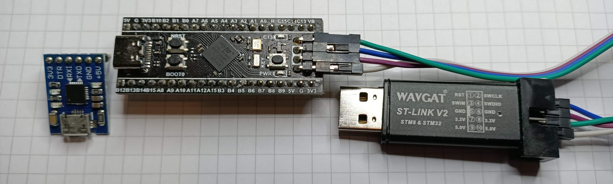

A simple project which runs on the **stm32f411 black pill** board (should also work on the stm32f401 variant, although memory.x should be altered to reflect the lower memory of the 401 board)


## Development Environment Prerequisites

* [VS Code](https://code.visualstudio.com/)
    * Extension: **Cortex-Debug**
    * Extension: **Rust-Analyser** (IMO works better than RLS)
    * I think other extensions are installed with the above
* [Rust and Cargo](https://www.rust-lang.org/tools/install)
* OpenOCD and gdb (so long ago, I can't remember the details!)
* Add the STM32F4 target to Rust (```cargo build``` should tell you what to do)
* [Serial terminal app](https://learn.adafruit.com/windows-tools-for-the-electrical-engineer/serial-terminal)
* If you use GitHub for your own repos, I recommend you install **[gh](https://github.com/cli/cli)** the GitHub command line interface
* ```cargo install cargo-generate```

## Hardware Requirements

* All hardware from aliexpress or your favorite Chinese parts stockist
* A "**black pill**" board. Get the **stm32f411** board - It has more more memory and faster clock speed than the stm32f401. **Do not** get the black version of the "blue pill" stm32f103 board, as the code is substantially different. ($4)
* An ST-Link V2, or clone ($2)
* A USB to Serial board. Mine is based on a **CP2102** chip and uses a microUSB cable instead of plugging straight into the USB port ($1)
* USB-C cable for the black pill
* An i2c mini display based on the ssd1306 chipset. I used the 4 pin (i2C) 0.96" white model
* You will probably need to solder the pins to the 2 boards
* Connect the ST-Link v2 to the Black Pill (used to upload and debug code)

| ST-Link V2 | Black Pill |
| --- | --- |
| Gnd | Gnd |
| TXO | PA10 (USART1 RX) |
| RXI | PA9 (USART1 TX) |

* Connect the USB-to-serial board to the black pill (used for the serial test)

| USB-to-serial | Black Pill 4 pin debug header |
| --- | --- |
| GND | GND |
| SWCLK | SWSCK |
| SWDIO | SWDIO |
| 3.3V | 3V3 |

## Generate your project
```
cargo generate --git https://github.com/gregwoods/stm32f4-05-serial --name your-project-name
```

## Set up source control for your project

```
cd your-project-name
git init
gh repo create --public your-project-name
git push
```

## Open Current Folder in [VS Code](https://code.visualstudio.com/)

```code .```

### Build

* Using VS Code's terminal (Ctrl + ')

```cargo build```
or
```cargo build --release```

### Connect the OLED board to the Black Pill

* SCL pin on the OLED to B8 on the black pill board
* SDA pin on teh OLED to B9 on the black pill board
* Vcc on the OLED to 3.3V on the black pill
* GND on the OLED to Gnd on the Black pill

### Run it

* In the VS Code Debug tab (Ctrl+Shift+D)...
* Select ```Debug (OpenOCD)``` or ```Release (OpenOCD)```
* F5 to Run
* The test message is printed on the OLED

## Problems

If you've followed these steps exactly, on the recommended hardware and it doesn't work, raise an issue.

